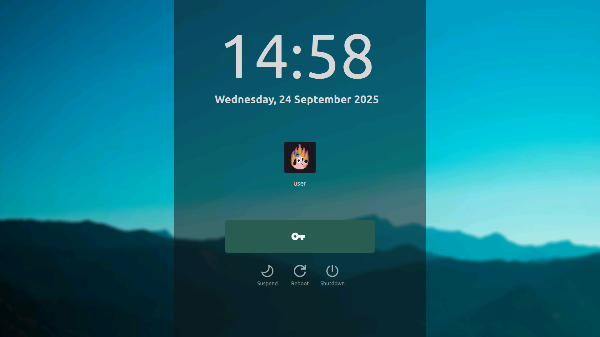

# MY SDDM THEME

Screenshot:

Modified SDDM Chili theme Based on original work of MarianArlt

[LINK](https://github.com/MarianArlt/sddm-chili)  
and thea sphaugh's fork, fixing the theme to work in QT6  
[LINK](https://github.com/sphaugh/sddm-chili)  
Tweaked to better line up its style with my simple lock screen

Redistributing under the saame license.
Original credits retained as below:

---

> Copyright 2018 Marian Arlt <marianarlt@icloud.com>
> Copyright 2016 David Edmundson <davidedmundson@kde.org>
> This program is free software; you can redistribute it and/or modify
>
> it under the terms of the GNU Library General Public License as
> published by the Free Software Foundation; either version 3 or
> (at your option) any later version.
>
> This program is distributed in the hope that it will be useful,
> but WITHOUT ANY WARRANTY; without even the implied warranty of
> MERCHANTABILITY or FITNESS FOR A PARTICULAR PURPOSE. See the
> GNU General Public License for more details
>
> You should have received a copy of the GNU Library General Public
> License along with this program; if not, write to the
> Free Software Foundation, Inc.,
> 51 Franklin Street, Fifth Floor, Boston, MA 02110-1301, USA.
